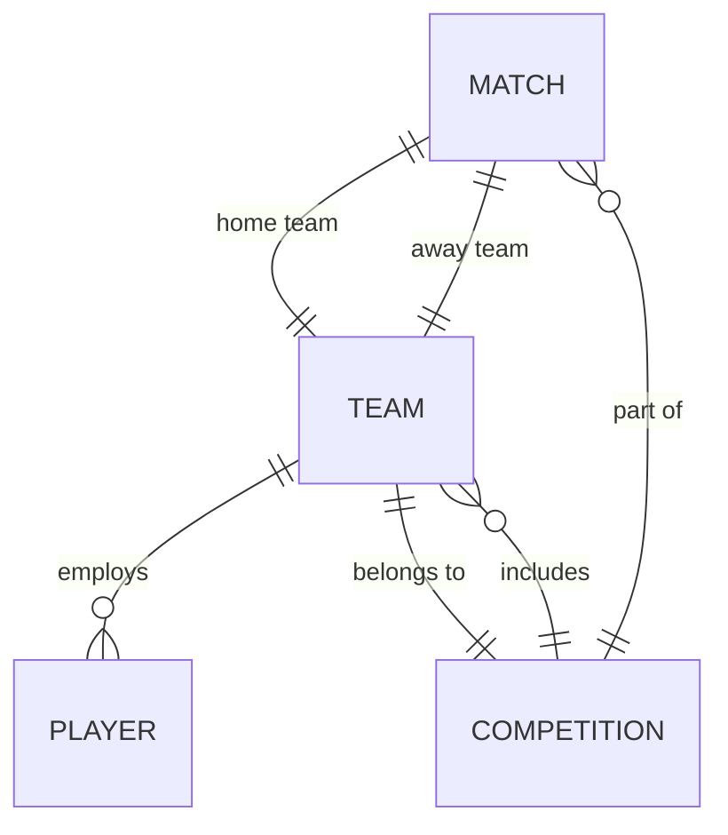

# ER Diagram

This document describes the Entity-Relationship diagram for the Football Management Simulator database schema.

Entities:

- **Team**: Represents a football club. Attributes: id, name, shortName, stadium, capacity, leagueId, manager, budget, players (array of Player IDs), tactics.
- **Player**: Represents a football player. Attributes: id, name, nationality, dateOfBirth, position, currentRating, potential, contract (teamId, salary, expiryDate), stats.
- **Competition**: Represents a league or cup. Attributes: id, name, type, country, teams (array of Team IDs), season, currentMatchday.
- **Match**: Represents a scheduled match. Attributes: id, homeTeamId, awayTeamId, competitionId, date, venue, status, score, halfTimeScore, events, statistics.

Relationships:

- A Team has many Players (one-to-many). Player belongs to one Team via contract.teamId.
- A Competition has many Teams (many-to-many) via teams array; Team belongs to a Competition via leagueId.
- A Match involves two Teams (home and away) as two one-to-many relationships.
- A Match belongs to a Competition (many-to-one).
